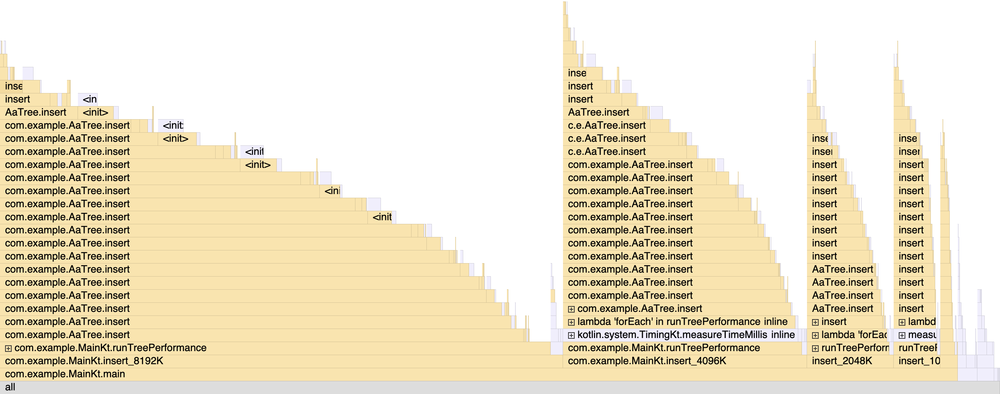
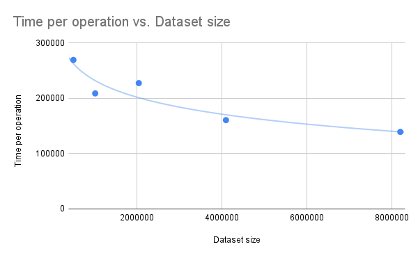
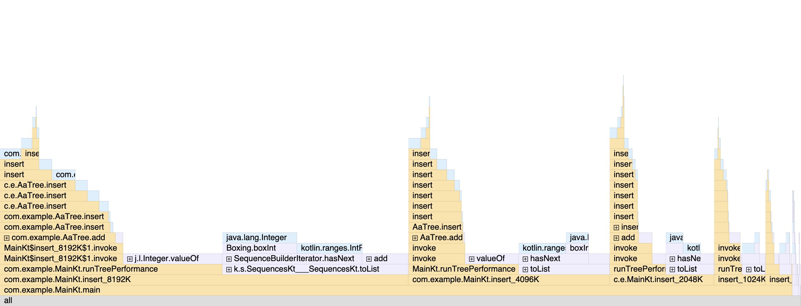
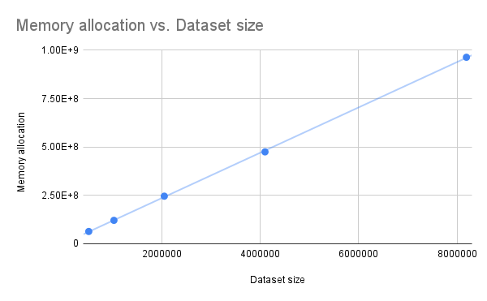

# Highload Software Architecture 8 Lesson 23 Homework

Profiling
---

## Test project setup

The project reuses the code from the [Lesson 19 Homework](https://github.com/serhii-samoilenko/hsa-homework-19) and adds profiling.

I already used built-in profiling in this project, but this time I'll use external profiler.

The program executes inserts of various datasets into the Tree. External profiler is used to measure the performance.

## How to build and run

Build and run demo application (Requires Java 11+)

```shell script
./gradlew run
```

Attach profiler to the running application and press Enter to start the load test.

There will be a 5-second pause between the test runs.

## Results

Since there is no suitable Input-sensitive profiler for Java, I used the standard profiler built into the IntelliJ IDEA.

I used distinct function names for the datasets to make it easier to distinguish them in the profiler results:

```kotlin
insert_512K()
insert_1024K()
insert_2048K()
insert_4096K()
insert_8192K()
```

### CPU Sampling results



This flamegraph shows time spent in the each `insert_*` function.

Numerical values are, % of time:

```
~ 95.8% com.example.MainKt.main(String[])
58.8% com.example.MainKt.insert_8192K()
25.5% com.example. MainKt.insert_4096K()
9.0% com.example.MainKt.insert_2048K()
4.9% com.example.MainKt.insert_1024K()
1.9% com.example.MainKt.insert_512K()
```

In a form of a chart:



This confirms that the time spent in the `insert_*` functions is logarithmically proportional to the size of the dataset.

### Memory Allocation results



This flamegraph shows memory allocations in the each `insert_*` function.

We also can see memory allocations of the same size when the dataset is allocated before being inserted into the Tree.

Numerical values are, KiB:

```
963_610K com.example. MainKt.insert_8192K()
474_797K com.example.MainKt.insert_4096K()
245_942K com.example.MainKt.insert_2048K()
120_937K com.example.MainKt.insert_1024K()
634_87K com.example.MainKt.insert_512K()
```

In a form of a chart:



This confirms that the memory allocations in the `insert_*` functions are linearly proportional to the size of the dataset.
